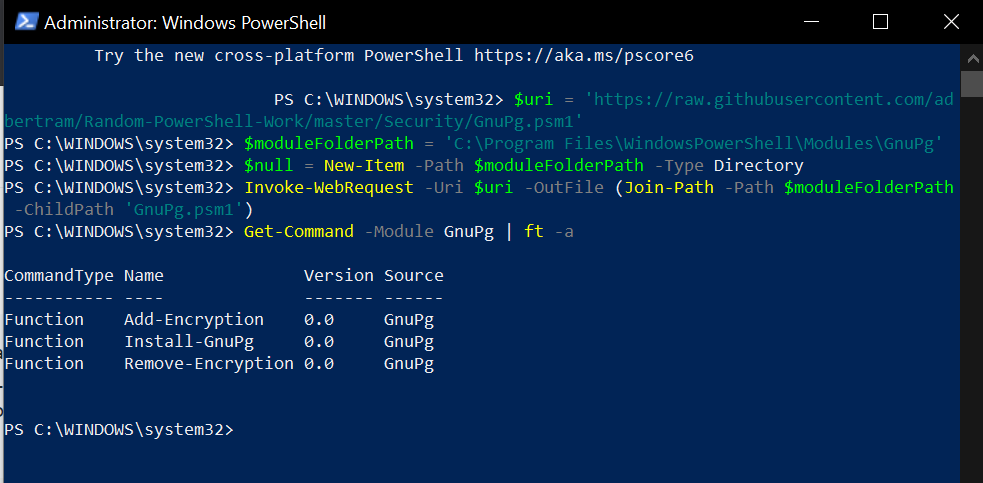
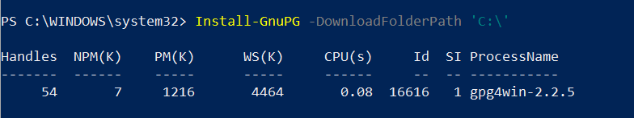
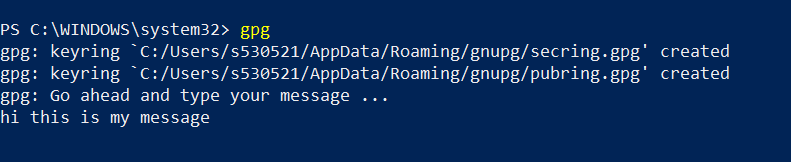
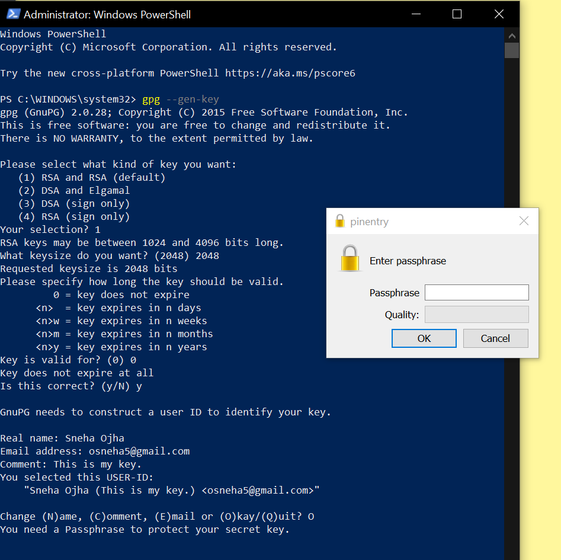
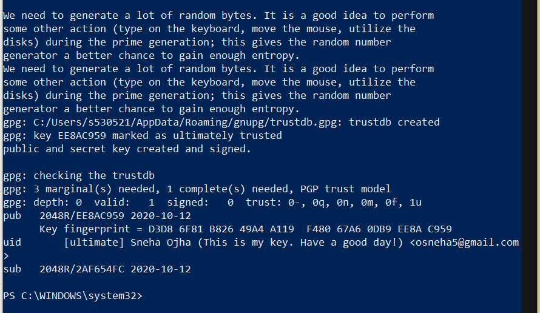
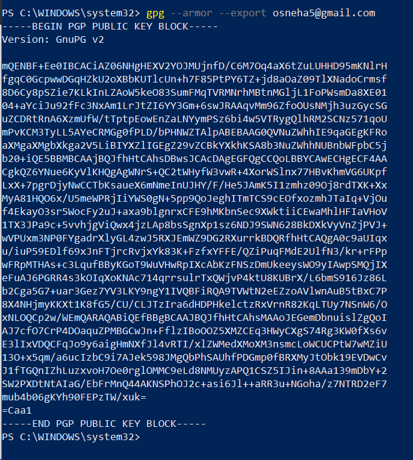
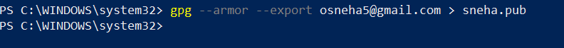

# Using Powershell To Explore Evidence

## Team Members
 1. Sneha Ojha
 1. Santhosh kumar Bollena
 1. Isaac Adesope (Cyber Security)
 1. Kamal Reddy Donthireddy
 
 
 
## Idea
Assuming there are two users UserA and UserB. UserB will be sharing the public key to the UserA. Now UserA can generate some data to a file and encrypt the data using the public key of the UserB and send the encrypted file to the UserB. Here, UserB can decrypt the data using the Private key of his own.

## Professor Suggestion

“crime” with three of your group members and then show how the forth member (or your viewers) could solve the case if they can get access to a perpetrator’s private key.

## Sub Topic:

- Santhosh Kumar Bollena will be assigned to generate public and private keys and encrypt the crime evidence using others public key.

- Sneha Ojha will be assigned to generate public and private keys and encrypt the crime evidence using others public key.

- Isaac Adesope will be assigned to generate public and private keys and encrypt the crime evidence using others public key.

- Kamal Reddy Donthireddy will be assigned to decrypt the evidence using his own private key. Also Kamal need to send the public key for crime encryption. 

## Advantages of using GpG for encryption.

-GPG was developed by Werner Koch and released in 1999 as an alternative to Symantec's software suite of encryption tools. It's available as a free software download and is based on the Open PGP encryption standards established by the IETF. This ensures that PGP is interoperable with Symantec's PGP tools, as well as Open PGP standards, and can open and unencrypt any PGP and Open PGP standards file.

- GPG (Gnu Privacy Guard) is a system for encryption of data that afterwards can be transmitted through open communication channels and kept in not protected storage. Open communication channels are email, cloud storage, instant messengers, and many others you probably use daily. These tools don’t provide any dependable data protection.

- GPG shield is quite reliable. It’s not possible to hack it using simple tools since it uses 2048-​bit keys and it is very resistant to the most complex hacking algorithms.

- GPG can be used for file signing also

- Another popular solution that follows the Open PGP standard and provides an interface for users to easily encrypt their files.

## GPG intallation steps

- Open powershell window as administrator.
- Copy and paste the following command
 ``` 
 $uri = 'https://raw.githubusercontent.com/adbertram/Random-PowerShell-Work/master/Security/GnuPg.psm1'
$moduleFolderPath = 'C:\Program Files\WindowsPowerShell\Modules\GnuPg'
$null = New-Item -Path $moduleFolderPath -Type Directory
Invoke-WebRequest -Uri $uri -OutFile (Join-Path -Path $moduleFolderPath -ChildPath 'GnuPg.psm1')
```
- Copy and paste the next command to get command for gnupg:

``` 
Get-Command -Module GnuPg | ft -a 
 
```



- To install gpg, use the following command

``` 
Install-GnuPG -DownloadFolderPath 'C:\'
```




- Try to execute the gpg command.

``` 
gpg 
```



- If the gpg is not found try to install again with the following command.

``` 
Install-GnuPg

```

- Try to execute gpg, If the gpg is not found try to close and reopen the powershell then execute the command.

## COmmand to generate keys
``` gpg --gen-key ```

1. RSA
1. 0
1. Name,email



-Create a strong passphrase.



## TO generate public key
``` gpg --armor --export kamalreddy4195@gmail.com ```

``` gpg --armor --export osneha5@gmail.com ```



## Adding public key to a file

- Public Key generation by Kamal

```gpg --armor --export kamalreddy4195@gmail.com > kamal.pub ```

- Public Key generation by Sneha 

```gpg --armor --export osneha5@gmail.com > sneha.pub ```



## References

https://4sysops.com/archives/encrypt-and-decrypt-files-with-powershell-and-pgp/
